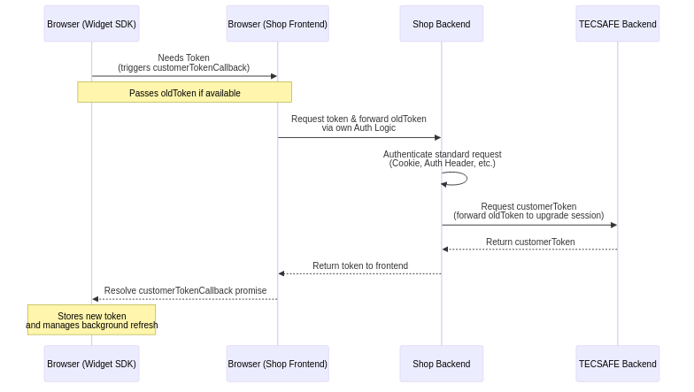
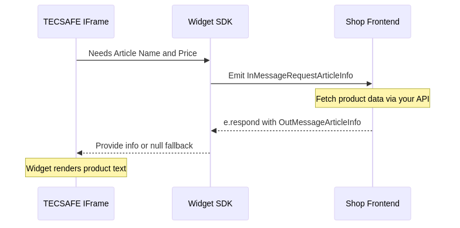
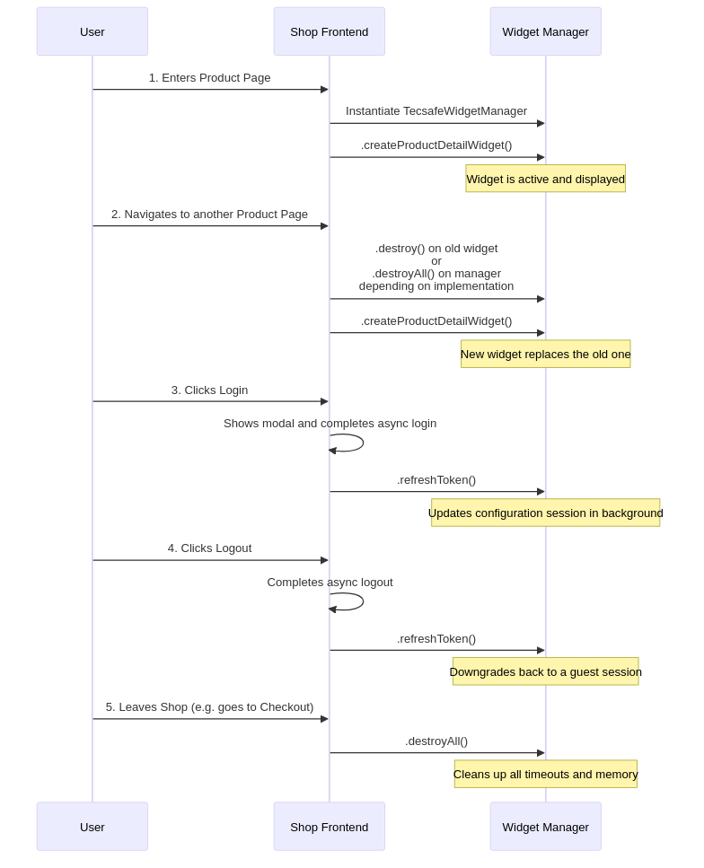

# Widget SDK

The TECSAFE Widget SDK provides a convenience wrapper to interact with TECSAFE Widgets
(PDP-Layout-Configurator, Layout-Editor, Layout-Project-App), handling IFrame communication and JWT
management automatically. The full Widget API documentation can be found on
[tecsafe.github.io/widget-sdk](https://tecsafe.github.io/widget-sdk).

## API Usage

The Widget SDK is publicly available on npm. You can install it via npm or yarn:

```bash
npm install @tecsafe/widget-sdk
```

### Initializing the SDK

First, initialize the
[`TecsafeWidgetManager`](https://tecsafe.github.io/widget-sdk/classes/TecsafeWidgetManager.html). It
requires three arguments:

1. [`customerTokenCallback`](https://tecsafe.github.io/widget-sdk/types/CustomerTokenCallback.html)//TODO:
   @joschua: Link gibt es nicht - wo finde ich die function definition? - der Link komt auch noch
   einmal weiter unten in der Architecture Section vor. Drt bitte auch anpassen.
2. [`addToCartCallback`](https://tecsafe.github.io/widget-sdk/types/AddToCartHandler.html)
3. [`widgetManagerConfig`](https://tecsafe.github.io/widget-sdk/classes/WidgetManagerConfig.html)

It is important to instantiate the manager only once, as otherwise the SDK could fetch multiple
salechannel customer tokens or cause duplicate event bindings.

```typescript
import { TecsafeWidgetManager } from '@tecsafe/widget-sdk'

const manager = new TecsafeWidgetManager(
  // 1. Customer Token Callback
  async (oldToken?: string) => {
    const response = await fetch('https://mybackend.com/tecsafe/saleschannel-customer-token', {
      method: 'POST',
      headers: { 'Content-Type': 'application/json'},
      body: JSON.stringify({ oldToken }),
    })
    const json = await response.json()
    return json.token
  },
  // 2. Add To Cart Handler
  {
    single: async (articleNumber, quantity, configurationId) => {
      // Your custom logic to add an item to the cart
      return true // Return boolean to indicate success
    },
  },
  // 3. Configuration
  new WidgetManagerConfig({ // TODO: @Joschua: muss das nicht erst importiert werden?
    trackingAllowed: true,
    languageRFC4647: 'en-US',
    currencyCodeISO4217: 'USD',
    taxIncluded: true,
  })
)
```

### Creating a Widget

Use the `manager` instance to create widgets and attach them to DOM elements. This will inject
TECSAFE iframes with the respectively requested applications. All available widgets alongside their
pupose can be found `(@tecsafe/widgetsdk >
Widget)[https://tecsafe.github.io/widget-sdk/classes/TecsafeWidgetManager.html]`

```javascript
const pdWidget = manager.createProductDetailWidget(
  document.getElementById('product-detail-widget')
  // TODO: @joschua: hier würde fehlt noch der neue Parameter
)
```

### Updating the saleschannel customer token

We are assuming two types of users within a selaschannel:
1. guest
2. registered / logged in customer

If a customer's login status changes you have to notify TECSAFE about that change. The (customer
token
API)[https://ofcp-api-gateway.staging.tecsafe.de/api#/Auth%20controller/AuthController_loginSaleschannelCustomer_v1]
will ensure that guest assets will be transferred to registered accounts on login and that
restigered customer sessions will be cleaned appropriately for a new guest session. You can update
the token by calling the
[`refreshToken`](https://tecsafe.github.io/widget-sdk/classes/TecsafeWidgetManager.html#refreshToken)
method. This will call the customerTokenCallback from the constructor. Alternatively, you can also
pass the token directly

```javascript
manager.refreshToken()

// Alternatively, you can also pass the token directly if you happen to have requested it already in the process.
manager.refreshToken('<new-token>')
```

### Unmounting & Cleanup

If a user withdraws consent, or navigates away from the page (relevant for SPAs), you should destroy
all widgets and clean up event listeners by calling the
[`destroyAll`](https://tecsafe.github.io/widget-sdk/classes/TecsafeWidgetManager.html#destroyAll)
method.

```javascript
manager.destroyAll()
```

## Widget Communication & Events

### Widget communication architecture

All communication between a widget and the hosting website functions via event-messaging. The Widget
SDK does the heavy lifting of the entire event setup and exposes all relevant events for
susbscription and publishing accordingly.

Events from hosting Website to the SDK are labelled as `OutMessages`, whereas events from the SDK to
the hosting website are labelled as `InMessages`. Anything in the documentation that is prefixed
with `Internal` refers to the internal event system plumbing and should not be relevant for
integrating TECSAFE functionality.

### Event Subscription

All exposed events should be subscribed to and implemented to guarantee the intended user experience
and data integrity. Please ensure to imlpement all `(@tecsafe/widgetsdk >
InMessages)[https://tecsafe.github.io/widget-sdk/classes/TecsafeWidgetManager.html]` accordingly.


## Architecture and Flows

Understanding the internal flows of the Widget SDK ensures a smooth integration into your project,
especially regarding authentication and cart interactions. The following section gives some
intrspection and more detailled implementation examples for a better understanding.

### Authentication Flow & Token Management

The TECSAFE Widget manager requires a valid customer token to identify users and link configurations
to their sessions. It handles both guest and registered customer sessions efficiently:

- When the **SDK** requires a token, it delegates to the
  [`customerTokenCallback`](https://tecsafe.github.io/widget-sdk/types/CustomerTokenCallback.html)
  provided upon initialization. This naturally occurs when the session requires a token or when it
  expires.
- Your **frontend** is expected to set up the
  [`customerTokenCallback`](https://tecsafe.github.io/widget-sdk/types/CustomerTokenCallback.html)
  such that it will send token requests to your **backend's** custom token endpoint (see below). The
  **SDK** provides the `oldToken` in the callback to maintain continuity. When your **backend**
  requests a new `customerToken` from the **TECSAFE backend**, it is **strictly necessary** to
  forward this `oldToken` as part of the request. The TECSAFE backend will then automatically merge
  the sessions. This guarantees that any products configured during a guest session are seamlessly
  transferred and assigned to a freshly logged in user or jump across states without data loss.
- Your **backend** is expected to provide a custom token Endpoint. It should validate the user (or
  guest session) via your own authentication logic (e.g., checking standard cookies/headers). Once
  autheticated the beackend should aggregate additional customer data (userID, email, search tags)
  and tunnel there entire request through to **TECSAFE's backend** using
  (/jwt/saleschannel-customer)[https://ofcp-api-gateway.staging.tecsafe.de/api#/Auth%20controller/AuthController_loginSaleschannelCustomer_v1].
- Please note:
  - that your provided userID is the unique customer identifier per saleschannel. Anything else can
  be changed on each request to update the customer on the TECSAFE platform.
  - that search tags are your flexible configuration option to cluster customers. These tags will be
    available in the cockpit application to filter customers and also manage access right and
    therefore should be carefully aligned with the responsible specalist department.




### Subscribing to Widget Events (e.g., RequestArticleInfo)

While the SDK handles internal events (like adding to the cart using your callback), you will often need to listen to and respond to specific widget events manually. **Even though every event is optional, it is highly recommended to implement as many as possible to significantly enhance the user experience.**

A prime example is providing article details when the widget requests them. Advanced features like upselling and proactive price previews strictly need the article info event to function correctly. Without implementing this event, the widget will only be able to show a "Price will be calculated in the cart" placeholder.

- When a widget needs to render product details or prices, it emits an [`InMessageRequestArticleInfo`](https://tecsafe.github.io/widget-sdk/variables/InMessageRequestArticleInfo.html) event.
- Your application must subscribe to this event using the SDK's [`.on()`](https://tecsafe.github.io/widget-sdk/classes/TecsafeWidgetManager.html#on) methodology.
- Once you retrieve the corresponding info from your backend or state, you respond directly using the [`.respond()`](https://tecsafe.github.io/widget-sdk/interfaces/WidgetMessageEvent.html#respond) function attached to the event payload.
- You MUST respond in the [`OutMessageArticleInfo`](https://tecsafe.github.io/widget-sdk/variables/OutMessageArticleInfo.html) format, providing either the details (like name and price) or `null` if the article is missing (so the widget can quickly show fallback UI rather than timing out).




### Single Page Application lifecycle

When navigating within a Single Page Application (SPA), it is crucial to handle the widget lifecycle properly to avoid duplicate instances or memory leaks. When a page transition occurs (e.g., leaving a product detail page), you should:

1. Call [`.destroy()`](https://tecsafe.github.io/widget-sdk/classes/BaseWidget.html#destroy) on the specific widget (e.g., if rendering a different product view), OR
2. Call [`.destroyAll()`](https://tecsafe.github.io/widget-sdk/classes/TecsafeWidgetManager.html#destroyAll) on the manager if no widgets are needed on the next view. This safely cleans up and resets the internal token refresh timeout.

**Manager Reset and Reuse:**
If you used `destroyAll()`, the current `TecsafeWidgetManager` cleans up efficiently. While you _can_ recycle and reuse the manager for [`.createProductDetailWidget()`](https://tecsafe.github.io/widget-sdk/classes/TecsafeWidgetManager.html#createProductDetailWidget) loops again later on, it is generally easier to instantiate a **new** [`TecsafeWidgetManager`](https://tecsafe.github.io/widget-sdk/classes/TecsafeWidgetManager.html) upon mounting the integration point again. However, if your Vue/React wrapper remains globally alive across routes, reusing the existing `.destroyAll()`-cleaned manager is perfectly fine and maintains the browser session. The `.destroyAll()` should not be needed for a cleanly implemented SPA which always
cleans up behind itself, using for example `onBeforeUnmount` or `useEffect` to destroy the widget, like in the `Vue.js example` below.




## Complete example implementation

### Pure HTML

```html
<!doctype html>
<html lang="en">
  <head>
    <meta charset="UTF-8" />
    <meta name="viewport" content="width=device-width, initial-scale=1.0" />
    <title>Tecsafe Widget SDK</title>
  </head>
  <body>
    <div id="product-detail-widget"></div>
    <script src="https://unpkg.com/@tecsafe/widget-sdk@latest/dist/index.js"></script>
    <script>
      const manager = new TecsafeWidgetManager(
        async (oldToken) => {
          const response = await fetch('https://mybackend.com/tecsafe/token', {
            method: 'POST',
            headers: { 'Content-Type': 'application/json' },
            body: JSON.stringify({ oldToken }),
          })
          const json = await response.json()
          return json.token
        },
        {
          single: async (articleNumber, quantity, configurationId) => {
            await fetch('https://mybackend.com/tecsafe/add-to-cart', {
              method: 'POST',
              headers: { 'Content-Type': 'application/json' },
              body: JSON.stringify({ articleNumber, quantity, configurationId })
            });

            if (!response.ok) {
              throw new Error(`HTTP error! status: ${response.status}`);
            }

            return true;
          },
        },
        new WidgetManagerConfig({
          trackingAllowed: true, //assuming that ccokies have been accepted by user
          languageRFC4647: 'en-US',
          currencyCodeISO4217: 'USD',
          taxIncluded: true,
        })
      )

      manager.on(InMessageRequestArticleInfo, (e) => { //TODO: @Joschua: ist das korrekt so?
        const response = await fetch('https://mybackend.com/tecsafe/articleInfo/' + { e.event.articleNumber })
        const articleInfo = await response.json()

        e.respond(OutMessageArticleInfo.create({
          articleNumber: e.event.articleNumber,
          info: {
            EAN: articleInfo.ean,
          name: articleInfo.name,
          price: articleInfo.price,
          priceTaxIncluded: true,
          },
        }))
      })

      manager.createProductDetailWidget(
        document.getElementById('product-detail-widget'),
        'SKU-123456'
      )
    </script>
  </body>
</html>
```

### Vue.js

```html
<template>
  <shop-base>
    <product-preview />
    <div ref="container" />
    <product-detail />
    <product-comments />
  </shop-base>
</template>

<script lang="ts" setup>
  import { onMounted, onBeforeUnmount, ref } from 'vue'
  import { TecsafeWidgetManager } from '@tecsafe/widget-sdk'

  const container = ref<HTMLElement | null>(null)
  const manager = ref<TecsafeWidgetManager | null>(null)

  onMounted(() => {
    if (!container.value) throw new Error('Container not found')

    manager.value = new TecsafeWidgetManager(
      async (oldToken) => {
          const response = await fetch('https://mybackend.com/tecsafe/token', {
            method: 'POST',
            headers: { 'Content-Type': 'application/json' },
            body: JSON.stringify({ oldToken }),
          })
          const json = await response.json()
          return json.token
        },
      {
        single: async (articleNumber, quantity, configurationId) => {
          await fetch('https://mybackend.com/tecsafe/add-to-cart', {
            method: 'POST',
            headers: { 'Content-Type': 'application/json' },
            body: JSON.stringify({ articleNumber, quantity, configurationId })
          });

          if (!response.ok) {
            throw new Error(`HTTP error! status: ${response.status}`);
          }

          return true;
        },
      },
      new WidgetManagerConfig({
        trackingAllowed: true,
        languageRFC4647: 'en-US',
        currencyCodeISO4217: 'USD',
        taxIncluded: true,
      })
    )

    manager.on(InMessageRequestArticleInfo, (e) => { //TODO: @Joschua: ist das korrekt so?
      const response = await fetch('https://mybackend.com/tecsafe/articleInfo/' + { e.event.articleNumber })
      const articleInfo = await response.json()

      e.respond(OutMessageArticleInfo.create({
        articleNumber: e.event.articleNumber,
        info: {
          EAN: articleInfo.ean,
          name: articleInfo.name,
          price: articleInfo.price,
          priceTaxIncluded: true,
        },
      }))
    })

    manager.createProductDetailWidget(
      document.getElementById('product-detail-widget'),
      'SKU-123456'
    )

  })

  onBeforeUnmount(() => {
    if (!manager.value) return
    manager.value.destroyAll()
  })
</script>
```
